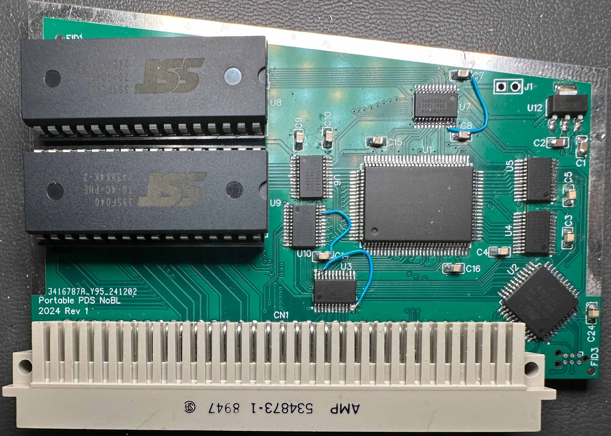
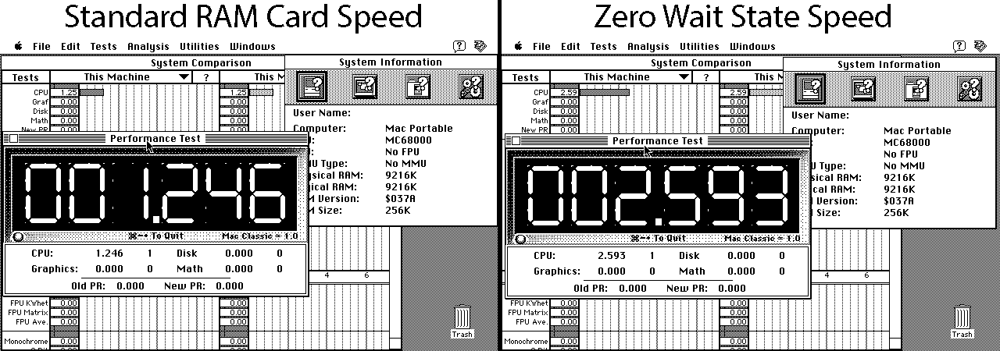
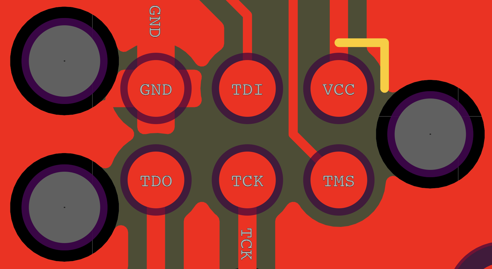

# Portable PDS NoBL

A PDS card for the Macintosh Portable adding 8MB of RAM running at zero wait states, as well as an optional 1MB of ROM.

It uses Cypress NoBL™ (short for No Bus Latency) SRAM.

Note: To get the full 9MB total (1MB internal + 8MB expansion) on the model M5126 backlit Macintosh Portable, a mapping modification is needed on the logic board otherwise only 8MB total will be usable.

Current Revision: Rev 2  
For previous revisions, open the previous_revisions folder or [click here](previous_revisions/).

For the generated Gerber board files and CPLD files, see [Releases](https://github.com/rezafouladian/PortablePDSNoBL/releases)

## Rev 1 Board Image



## Speed Comparison

With access to the <span style="text-decoration:overline">DTACK</span> signal, RAM access speeds are greatly increased compared to regular 8MB RAM cards, especially when going over the 5MB mark.  



The speed difference is quite noticable in regular use with the stack being located at the end of RAM.

This also gets around a design issue where RAM above 5MB may run slower after sleep if the address for an unreleased Apple accessory has not been accessed.

## DIP Switch Settings

| SW | Off | On |
| --- | --- | --- |
| 1 | 4MB RAM | 8MB RAM |
| 2 | No Diagnostic ROM | Diagnostic ROM at $F80000 |
| 3 | No ROM | ROM at $A00000 |

## Using the ROM
Turning on DIP switch 3 will enable the ROM on the card. It is located from $A00000 to $AFFFFF in the Portable's memory space.

You can use this ROM to add ROM Disks or other code.

## Using the Diagnostic ROM
The diagnostic ROM space is placed at $F80000 in the Portable's memory space.

If you are using 4Mbit ROMs (1MB total) then the start of the diagnostic ROM space will be halfway through the ROM at $80000.  
If you use 2Mbit or smaller ROMs then you should be able to place the diagnostic code at the start of the ROM.

## Programming
To write to the CPLD using the ISP header, you will need a 6-pin Tag-Connect cable (TC2030-IDC-NL, TC2030-MCP-NL, etc.) and a JTAG programmer.

Ensure the TC2030 pinout is hooked up matching the board:  


Here is an example for using a [Tigard](https://github.com/tigard-tools/tigard) and OpenOCD to program the CPLD:

Create a config file (`tigard-jtag.cfg`) to write the playback file (`nobl-rev2.svf`):
```
interface ftdi
ftdi_vid_pid 0x0403 0x6010
ftdi_channel 1
adapter_khz 2000
ftdi_layout_init 0x0038 0x003b
ftdi_layout_signal nTRST -data 0x0010
ftdi_layout_signal nSRST -data 0x0020
transport select jtag
init
svf nobl-rev2.svf
```

Set the Tigard to 5V.

With the config file and the playback file in the same directory, run `openocd -f tigard-jtag.cfg` with the TC2030 connected to the board.

### Building the CPLD Code
To build the `.svf` playback file, open the `.pld` file in WinCUPL and run Device Dependent Compile.  
Next open ATMISP and select the New option. Set the device to ATF1502AS, JTAG Instruction to Program/Verify, and open the `.jed` file generated by WinCUPL. Check the box for Write SVF file then click Run.


---

NoBL and No Bus Latency are trademarks of Cypress Semiconductor Corporation.
